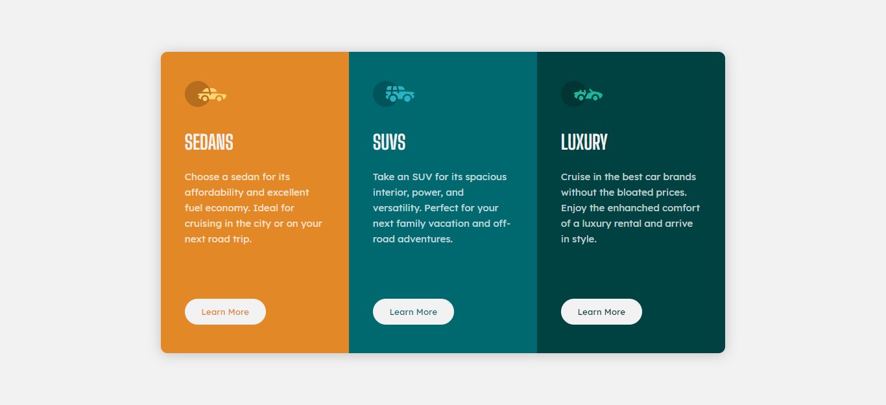
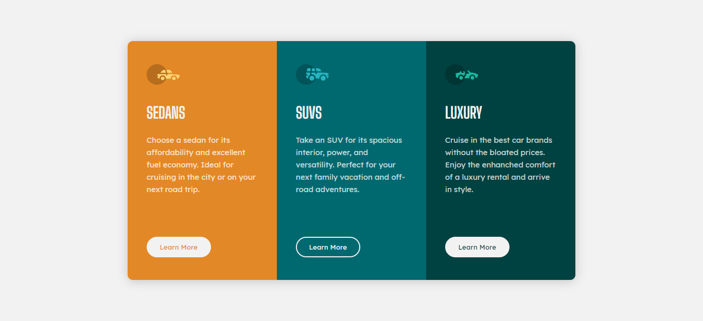

# Frontend Mentor - Stats preview card component solution

This is a solution to the [Stats preview card component challenge on Frontend Mentor](https://www.frontendmentor.io/challenges/stats-preview-card-component-8JqbgoU62).

## Link

[Live here - https://faraaiden-fementor-ch2.netlify.app/](https://faraaiden-fementor-ch2.netlify.app/)

## Screenshot
*On mobile*  

*On desktop/larger screen*  

*On hover*  

## Built with

- Semantic HTML5 markup
- SCSS
- CSS Grid
- Mobile-first workflow
