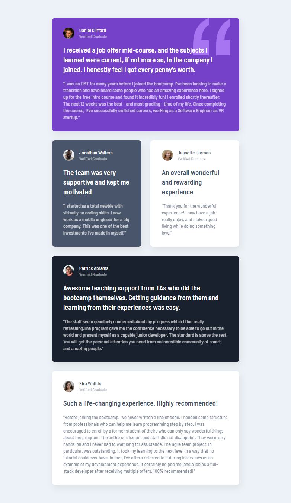
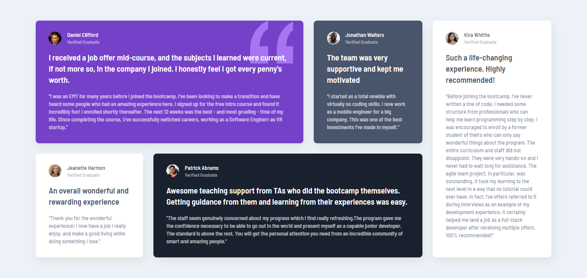

# Frontend Mentor - Testimonials grid section solution

This is a solution to the [Testimonials grid section challenge on Frontend Mentor](https://www.frontendmentor.io/challenges/testimonials-grid-section-Nnw6J7Un7).

## Live

[Live here - https://faraaiden-fementor-ch6.netlify.app/](https://faraaiden-fementor-ch6.netlify.app/)

## Screenshot

_On mobile_  

_On tablet_  

_On desktop/larger screen_  

## Built with

- Semantic HTML5 markup
- SCSS
- CSS Grid
- Mobile-first workflow
