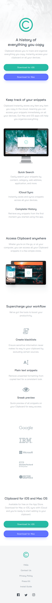
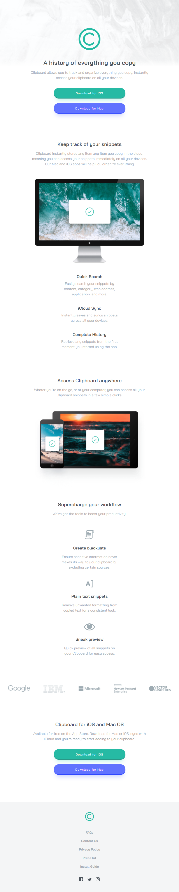
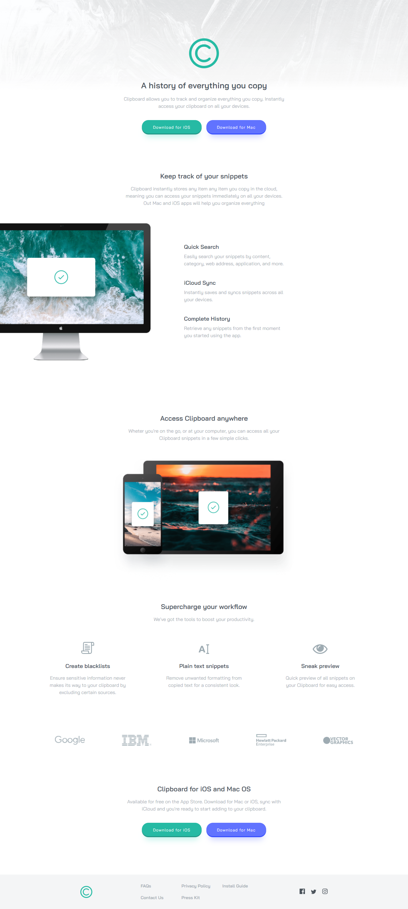

# Frontend Mentor - Clipboard landing page solution

This is a solution to the [Clipboard landing page challenge on Frontend Mentor](https://www.frontendmentor.io/challenges/clipboard-landing-page-5cc9bccd6c4c91111378ecb9).

## Live

[Live here - https://faraaiden-fementor-ch7.netlify.app/](https://faraaiden-fementor-ch7.netlify.app/)

## Screenshot

_On mobile_  

_On tablet_  

_On desktop/larger screen_  

## Built with

- Semantic HTML5 markup
- SCSS
- CSS Grid
- CSS Flexbox
- Mobile-first workflow
